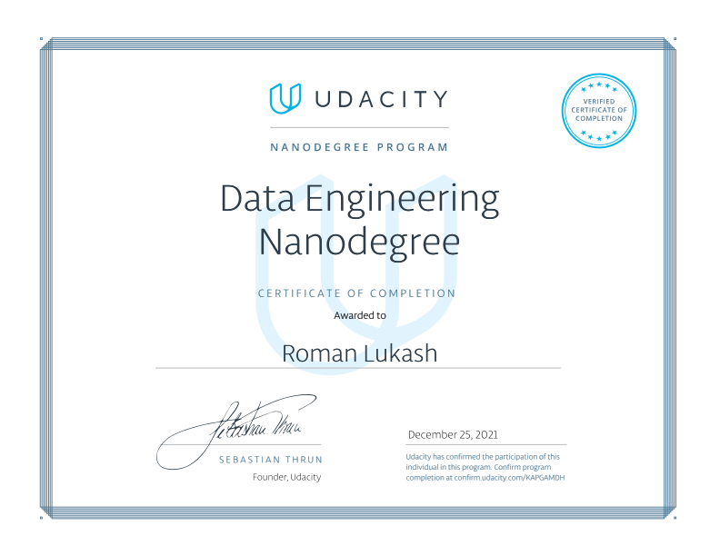

# Data Engineering Nanodegree
---

All projects of Udacity's Data Engineering Nanodegree.

[Course page](https://www.udacity.com/course/data-engineer-nanodegree--nd027)

> Python, Postgres, Casandra, Redshift, Apache Spark, Airflow,  
> Dimensional modelling, ETL

## Certificate

## About The Nanodegree

## Program details

#### **Course 1 – Data Modeling**
- Understand Data Warehousing architecture
- Run an ETL process to denormalize a database (3NF to Star)
- Create an OLAP cube from facts and dimensions
- Compare columnar vs. row oriented approaches
- Understand cloud computing
- Create an AWS account and understand their services
- Set up Amazon S3, IAM, VPC, EC2, RDS PostgreSQL
- Identify components of the Redshift architecture
- Run ETL process to extract data from S3 into Redshift
- Set up AWS infrastructure using Infrastructure as Code
(IaC)
- Design an optimized table by selecting the appropriate
distribution style and sorting key

Related projects:
#### [Data Modeling with Postgres](https://github.com/happytomatoe/data-modeling-with-postgres)
#### [Data Modeling with Apache Cassandra](https://github.com/happytomatoe/data-modeling-with-cassandra)

#### **Course 2 – Cloud Data Warehouses**

Related project: 

#####  [Build a Data Lake project](https://github.com/happytomatoe/data-modeling-with-redshift)
In this project, we are tasked with building an ELT pipeline that
extracts their data from S3, stages them in Redshift, and transforms
data into a set of dimensional tables for their analytics team to
continue finding insights in what songs their users are listening to.

#### **Course 3 – Data Lakes with Apache Spark**

##### [Data Pipelines with Airflow project]()
In this project, we’ll build an ETL pipeline for a data lake. The data
resides in S3, in a directory of JSON logs on user activity on the app,
as well as a directory with JSON metadata on the songs in the app.
we will load data from S3, process the data into analytics tables
using Spark, and load them back into S3. we’ll deploy this Spark
process on a cluster using AWS.

#### **Course 4 – Data Pipelines with Apache Airflow**

#### [Data Pipelines with Airflow project](https://github.com/happytomatoe/data-pipelines-with-airflow)

#### **Capstone Project**

#### [Yelp ETL pipeline project](https://github.com/happytomatoe/yelp-etl-pipeline)
In this project I will transform initial data into dimensional model using star schema and export it into redshift. 
And to show results will make exploratory data analysis